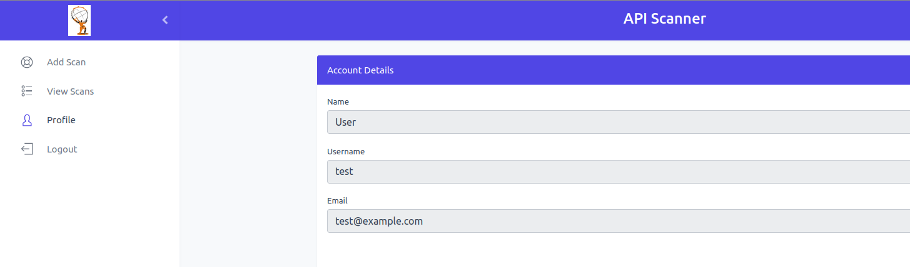

# API Security Scanner Manual

## Accessing the Panel

On your desktop, open a browser (Firefox or Chrome, recommended: Firefox) and enter the following address.
https://localhost:17443

- You will get a self-signed certificate error message.  Click the 'Advanced' button and then click the 'Accept the Risk and Continue' button.


- Then, the panel with show the user account creation page. Fill out the form with username, password, and email address. 

Note: The email address is just for user creation. It is not used or uploaded to any external server.


 
- Once created you will get a login page, you can provide the username and password to log in. Once logged in, you can see the API Scanner home page.


## How to scan an API?

### Prerequisites
Before you begin, make sure you have the following:

> An OpenAPI definition file (.yaml or .yml format) for the target API.
>
> Optional: Any necessary HTTP headers, such as the Authorization header for API authentication.

 

### Steps

### 1. Login and Access the Add Scan Page

- Open a web browser and navigate to the API scanner panel.
- Enter your login credentials to access your account.
- From the side menu, locate and click on the 'Add Scan' option. This will take you to the Add Scan page.

### 2. Upload the OpenAPI Definition File

- On the Add Scan page, you will find a 'Select OpenAPI File' section.
- Click on the 'Browse' button next to the 'Select OpenAPI File' field.
- In the file selection dialog, navigate to the location where the OpenAPI definition file is stored.
- Select the appropriate file (in .yaml or .yml format) and click 'Open' to select it.

##  3. Optional: Enter HTTP Headers (e.g., Authorization)

- If your API requires specific HTTP headers for authentication or other purposes, you can specify them in this step.
- Look for the 'HTTP Headers' section on the Add Scan page.
- To add an HTTP header, click on the plus button next to 'Add HTTP Header'. This will add additional input fields.
- In each added input field, specify the 'Header Name' and 'Header Value' for the respective HTTP header.
- You can select predefined header names like 'Authorization' or 'x-api-key' from a drop-down menu, or select 'Custom' and enter your custom header name.
- Click on the plus button again, if you want to add more than one additional HTTP header.

## 4. Initiate the Scan

Once you are ready to initiate the scan, click on the 'Add' button. Once a scan is added, it will display a 'success' message. Ensure that the API Scanner VM machine can reach the API Server. Otherwise, when attempting to add a scan, it will show an error message stating 'Unable to reach the API Server URL.'
    
> Note: The API scanner will initiate and start the scan, once it completes the pending scans. If it is the initial scan, then the scan will start immediately.

## View scans

From the side menu, locate and click on the 'View Scans' option. This will take you to the scans list page.


This page displays a table containing rows with information about each scan, including the API URL, scan status, completed time, and options to download the scan report. 
    
### Scans Table

The scans table provides an overview of all the scans performed on your APIs. Each row represents a specific scan and includes the following information:

#### _API URL_

The URL or endpoint of the API that was scanned.

#### _Scan Status_

The current status of the scan indicates whether it is in progress, completed, or encountered any errors.

#### _Completed time_

The timestamp indicates when the scan was completed.

#### _Download Report_

This button allows you to download the scan report. The report is available only if the scan status is 'Scan Completed.' The report provides detailed information about the scan results including any identified vulnerabilities or security risks.

#### _Download error requests.zip_

This button enables you to download a ZIP file containing error requests encountered during the scan. Error requests may include erroneous responses or other issues. The file gets downloaded only if the scan produces server errors during the fuzzing process.


#### _Delete Scan_

To delete the scan, click on the 'Delete' option. Once deleted, it will display a 'success' message.

## Profile

In the view menu, you can see the name, username, and email address.



## Logout

You can click on 'Logout' to logout from the panel.

## Forgot Password

- In case of a forgotten password you will need to destroy and rebuild the VM per the below step. And then go through the setup again.

    ```
    vagrant destroy apiscannervm
    ```
